# Screenpipe — Core Technical Architecture

> **Status**: Living Document
> **Scope**: Engine, DB, Audio, Vision, Pipes, API, UI bridge
> **Audience**: Engineers, integrators, and new contributors

---

## Table of Contents

1. [Introduction & Design Philosophy](#1-introduction--design-philosophy)
2. [System Overview](#2-system-overview)
3. [Component Architecture](#3-component-architecture)
   - 3.1 [Crate Topology](#31-crate-topology)
   - 3.2 [Runtime Topology](#32-runtime-topology)
   - 3.3 [High-Level Component Diagram](#33-high-level-component-diagram)
4. [Data Format Specifications](#4-data-format-specifications)
   - 4.1 [Core Domain Types](#41-core-domain-types)
   - 4.2 [Database Schema](#42-database-schema)
   - 4.3 [Capture & Snapshot Payloads](#43-capture--snapshot-payloads)
   - 4.4 [Audio Pipeline Payloads](#44-audio-pipeline-payloads)
   - 4.5 [UI Event Payloads](#45-ui-event-payloads)
   - 4.6 [Search & Content Payloads](#46-search--content-payloads)
   - 4.7 [Pipe Configuration & Permissions](#47-pipe-configuration--permissions)
   - 4.8 [Health & Metrics Payloads](#48-health--metrics-payloads)
   - 4.9 [WebSocket Event Stream](#49-websocket-event-stream)
5. [Data Flow Analysis](#5-data-flow-analysis)
   - 5.1 [Vision Capture Flow (Event-Driven)](#51-vision-capture-flow-event-driven)
   - 5.2 [Audio Capture Flow](#52-audio-capture-flow)
   - 5.3 [Search & Retrieval Flow](#53-search--retrieval-flow)
   - 5.4 [Pipe Execution Flow](#54-pipe-execution-flow)
   - 5.5 [Timeline Streaming Flow](#55-timeline-streaming-flow)
   - 5.6 [End-to-End System Flow](#56-end-to-end-system-flow)
6. [Storage Layout](#6-storage-layout)
7. [Configuration Surfaces](#7-configuration-surfaces)
8. [Glossary](#8-glossary)
9. [Appendix: Cross-Reference](#9-appendix-cross-reference)

---

## 1. Introduction & Design Philosophy

Screenpipe is an open-source, local-first capture-and-recall engine. It continuously
records screen, audio, and input modalities on a user's device, indexes the resulting
streams into a single SQLite database, and exposes a typed HTTP/WS API for search,
timeline rendering, and AI-agent (Pipe) execution.

**Design tenets** (derived from the project's own `DESIGN.md` / philosophy):

| Tenet | Operational consequence |
|-------|------------------------|
| **Privacy first** | All data is stored locally by default. Cloud features are opt-in. No required telemetry. |
| **Local-first execution** | OCR runs natively (Apple Vision / Windows OCR / Tesseract). STT runs locally via Whisper. Cloud STT/embeddings are user-configured. |
| **Simplicity** | One capture system per modality, not three competing polling loops. Decoupled workers, never blocking the capture loop. |
| **Open source** | All data formats, DB schema, and API surface are public; no proprietary blobs. |
| **Progressive disclosure** | A simple `npx screenpipe record` works for casual users; an enterprise admin can centrally govern every Pipe's permissions. |

**Non-goals** (current iteration): full video playback of past sessions, on-server
remote control without an API key, dependency on any specific cloud provider.

---

## 2. System Overview

A single binary (`screenpipe` / `screenpipe-engine`) hosts:

1. **Capture pipelines** for vision (per-monitor) and audio (per-device).
2. **A unified SQLite database** with FTS5, embedding tables, and sync metadata.
3. **An Axum-based HTTP/WebSocket server** exposing REST + streaming endpoints on `localhost`.
4. **A Pipe runtime** that schedules and runs AI agents (the `pi` agent by default) on captured data.
5. **An MCP server** so external AI clients (Claude Desktop, Cursor) can query the local data.
6. **Optional desktop shell** (Tauri) that consumes the engine over the same HTTP API.

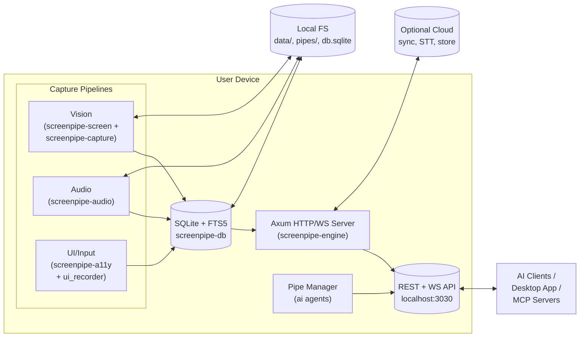

---

## 3. Component Architecture

### 3.1 Crate Topology

The Rust workspace is organized by concern. Each crate has a narrow public surface
and a well-defined responsibility.

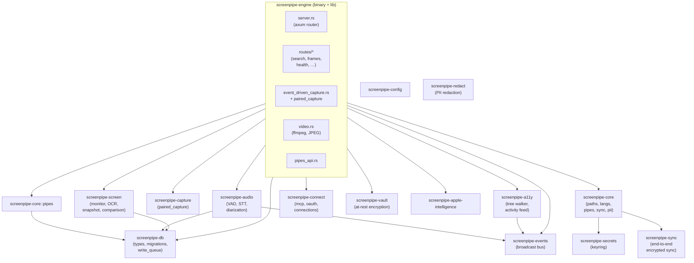

**Crate responsibilities (summary)**

| Crate | Responsibility |
|-------|----------------|
| `screenpipe-engine` | HTTP/WS server, capture loop, pipes, integrations. The only binary in the workspace. |
| `screenpipe-db` | SQLite schema, migrations, typed access, write queue, FTS5 helpers. |
| `screenpipe-audio` | Device enumeration, VAD（voice activity detection）, Whisper/Deepgram STT, diarization, audio metrics. |
| `screenpipe-screen` | Monitor enumeration, screenshot, OCR engines, frame comparison, snapshot writer. |
| `screenpipe-capture` | `paired_capture`: atomic screenshot + AX tree + JPEG write. |
| `screenpipe-a11y` | Accessibility tree walker (AX on macOS, UIA on Windows, AT-SPI on Linux), UI event tap, activity feed. |
| `screenpipe-core` | Cross-cutting utilities: paths, languages, PII removal, sync, **pipe runtime**, permissions. |
| `screenpipe-connect` | MCP server/client, OAuth refresh, external connections (Telegram, Slack, …), browser bridge. |
| `screenpipe-events` | In-process pub/sub used by the WebSocket layer. |
| `screenpipe-vault` | Optional AES-GCM encryption of data at rest. |
| `screenpipe-secrets` | OS keyring-backed credential store. |
| `screenpipe-redact` | On-device PII redaction (ML model + heuristics). |
| `screenpipe-apple-intelligence` | macOS-only on-device chat-completions endpoint. |

### 3.2 Runtime Topology

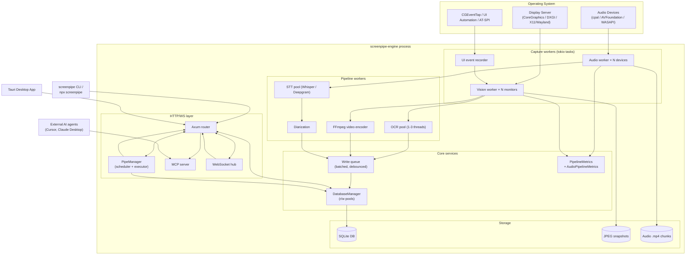

### 3.3 High-Level Component Diagram

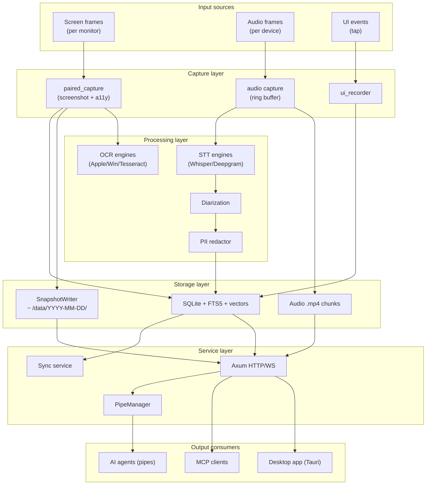

---

## 4. Data Format Specifications

All public types live in `screenpipe-db/src/types.rs` and `screenpipe-core/src/pipes`.
This section documents the wire shape, field semantics, and storage representation.

### 4.1 Core Domain Types

#### 4.1.1 `SearchResult` (enum)

`SearchResult` is the unified response element for `/search`. Tagged by
`content_type` upstream; serialized as a `ContentItem` (see 4.6) over HTTP.

```rust
enum SearchResult {
    OCR(OCRResult),                   // screen / window text
    Audio(AudioResult),               // transcribed speech
    UI(UiContent),                    // accessibility tree traversal (legacy)
    Input(UiEventRecord),             // clicks, keystrokes, clipboard
    Memory(MemoryRecord),             // persistent facts/preferences
}
```

#### 4.1.2 `OCRResult` (frame-derived text)

| Field | Type | Description |
|-------|------|-------------|
| `frame_id` | `i64` | DB primary key of the `frames` row. |
| `frame_name` | `String` | Display name (e.g. `monitor_1_2026-02-06_10-30-00.jpg`). |
| `ocr_text` | `String` | Concatenated text. For most modern rows this is AX-derived. |
| `text_json` | `String` | Structured per-block text with bounding boxes (JSON). |
| `timestamp` | `DateTime<Utc>` | When the screenshot was captured. |
| `file_path` | `String` | Absolute path to the JPEG snapshot (post-2026-02) or the legacy MP4 chunk. |
| `offset_index` | `i64` | Frame number within the legacy video chunk. `0` for snapshot-only frames. |
| `app_name` | `String` | Foreground app name (e.g. `Slack`). |
| `ocr_engine` | `String` | `"apple"`, `"windows"`, `"tesseract"`, `"unstructured"`, or `"custom"`. |
| `window_name` | `String` | Window title. |
| `tags` | `Vec<String>` | User-applied tags. |
| `browser_url` | `Option<String>` | URL when app is a browser. |
| `focused` | `Option<bool>` | Whether the window was focused at capture time. |
| `device_name` | `String` | Monitor / device identifier. |
| `text_source` | `Option<String>` | `"accessibility"` (preferred) or `"ocr"` (fallback). `None` for legacy rows. |

#### 4.1.3 `AudioResult` (transcribed speech)

| Field | Type | Description |
|-------|------|-------------|
| `audio_chunk_id` | `i64` | DB primary key of `audio_chunks`. |
| `transcription` | `String` | STT output. |
| `timestamp` | `DateTime<Utc>` | Capture time. |
| `file_path` | `String` | Path to the audio chunk MP4. |
| `offset_index` | `i64` | Frame number within the audio chunk. |
| `transcription_engine` | `String` | `"whisper"`, `"deepgram"`, or custom. |
| `tags` | `Vec<String>` | User-applied tags. |
| `device_name` | `String` | `"MacBook Pro Microphone"` etc. |
| `device_type` | `DeviceType` | `Input` or `Output`. |
| `speaker` | `Option<Speaker>` | Resolved speaker identity. |
| `speaker_label` | `Option<String>` | Raw label from the diarization engine. |
| `speaker_source` | `Option<String>` | `"diarization"`, `"manual"`, etc. |
| `speaker_confidence` | `Option<f64>` | 0..1 confidence. |
| `speaker_provisional` | `bool` | `true` if assigned but not yet confirmed. |
| `start_time` / `end_time` | `Option<f64>` | Segment offset (seconds) inside the audio chunk. |
| `source` | `Option<String>` | `"meeting"`, `"realtime"`, etc. |
| `meeting_id` | `Option<i64>` | Link to a detected or manual meeting. |
| `provider` / `model` | `Option<String>` | STT provider/model. |

#### 4.1.4 `ContentType` (search filter)

```rust
enum ContentType {
    All,            // OCR + Audio + Accessibility
    OCR,            // screen text
    Audio,          // transcribed speech
    Input,          // user input events
    Accessibility,  // accessibility tree
    Memory,         // persistent memory
}
```

Wire form: lowercase strings (`"all"`, `"ocr"`, …). `All` is the default.

#### 4.1.5 `UiEventType` (input modality)

```rust
enum UiEventType { Click, Move, Scroll, Key, Text, AppSwitch, WindowFocus, Clipboard }
```

Wire form: snake_case strings (`"app_switch"`). Stable on the wire — clients should
deserialize by `FromStr` rather than re-implement the mapping.

#### 4.1.6 `Speaker`

```rust
struct Speaker { id: i64, name: String, metadata: String }
```

`metadata` is a free-form JSON string (centroid embeddings, model provenance,
override notes). Schema is not enforced at the type level.

#### 4.1.7 `MemoryRecord`

| Field | Type | Description |
|-------|------|-------------|
| `id` | `i64` | Primary key. |
| `content` | `String` | The fact / preference / decision. |
| `source` | `String` | Origin: `"pipe"`, `"manual"`, `"external_sync"`. |
| `source_context` | `Option<String>` | JSON metadata. |
| `tags` | `Option<String>` | JSON array of tags. |
| `importance` | `f64` | 0..1 priority score. |
| `frame_id` | `Option<i64>` | Originating screen frame, if any. |
| `created_at` / `updated_at` | `String` | RFC-3339 timestamps. |

### 4.2 Database Schema

The schema evolves through `crates/screenpipe-db/src/migrations/*.sql`. The
following are the load-bearing tables; full column lists are in the migrations
folder.

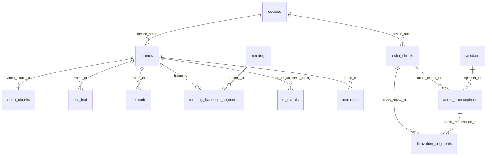

**Key tables**

| Table | Purpose | Notable columns |
|-------|---------|-----------------|
| `frames` | One row per captured screen frame. | `id`, `timestamp`, `device_name`, `app_name`, `window_name`, `browser_url`, `file_path` (snapshot or video), `offset_index`, `ocr_text` (denormalized for FTS), `accessibility_text`, `text_source`, `capture_trigger`, `snapshot_path`, `image_redacted`. |
| `video_chunks` | Legacy per-monitor MP4 chunks (kept read-only for backward compat). | `id`, `file_path`, `device_name`, `fps`. |
| `audio_chunks` | Continuous audio recordings. | `id`, `file_path`, `timestamp`, `device_name`, `is_input_device`, `processing_status`, `attempts`, `evicted_at`. |
| `audio_transcriptions` | Whisper/Deepgram output segments. | `audio_chunk_id`, `transcription`, `start_time`, `end_time`, `offset_index`, `speaker_id`, `transcription_engine`. |
| `diarization_segments` | Per-speaker timing inside an audio segment. | `audio_chunk_id`, `audio_transcription_id`, `provider_speaker_label`, `speaker_id`, `start_time`, `end_time`, `confidence`. |
| `speakers` | Resolved speaker identity. | `id`, `name`, `metadata`, `centroid_embedding`. |
| `meetings` | Detected or manually-started meeting sessions. | `id`, `meeting_start`, `meeting_end`, `meeting_app`, `title`, `attendees`, `note`, `detection_source`, `end_reason`. |
| `meeting_transcript_segments` | Per-segment transcript tied to a meeting. | `meeting_id`, `audio_transcription_id`, `audio_chunk_id`, `transcript`, `speaker_id`, `captured_at`. |
| `ui_events` | User input events (clicks, keystrokes, clipboard). | `id`, `timestamp`, `event_type`, `app_name`, `window_title`, `x`, `y`, `key_code`, `text_content`, `frame_id`. |
| `elements` | Per-frame accessibility nodes (ref-counted). | `id`, `frame_id`, `ref_frame_id`, `role`, `name`, `value`, `bounds`, `on_screen`, `text_hash`. |
| `pipe_executions` | History of pipe runs. | `id`, `pipe_name`, `started_at`, `finished_at`, `status`, `session_path`, `error`. |
| `memories` | Persistent knowledge base. | `id`, `content`, `source`, `importance`, `frame_id`, `sync_uuid`, `sync_modified_by`. |
| `tags` | User-applied tags per content type. | `(content_type, content_id, tag)`. |

**FTS5 virtual tables**

- `ocr_text_fts` — index over `ocr_text` (FTS5 external content, frames).
- `frames_fts` — index over the consolidated text columns of `frames`.
- `audio_transcriptions_fts`, `audio_chunks_fts` — FTS5 for transcriptions.
- `elements_fts` — FTS5 over accessibility node text.
- `memories_fts` — FTS5 over memory `content`.

**Migration history (excerpt)** — see `screenpipe-db/src/migrations/` for full list.

| Date | Migration | Purpose |
|------|-----------|---------|
| 2024-07-03 | `screenpipe.sql` | Initial schema (frames, ocr_text, audio_chunks, audio_transcriptions). |
| 2025-02-20 | `add_accessibility_and_input_tables.sql` | `accessibility` and `ui_monitoring` tables. |
| 2026-02-20 | `event_driven_capture.sql` | Adds `snapshot_path`, `accessibility_text`, `capture_trigger`, `text_source` to `frames`. |
| 2026-02-25 | `create_meetings.sql` | Meetings table + linking. |
| 2026-03-12 | `consolidate_search_to_frames_full_text.sql` | Move search to a unified `frames` FTS table. |
| 2026-03-31 | `create_memories.sql` | Long-term memory store. |
| 2026-05-15 | `audio_diarization_tables.sql` | `diarization_segments` + speaker centroid. |
| 2026-05-20 | `audio_chunk_processing_status.sql` | Tracks `processing_status` (pending/transcribed/silent/failed) on `audio_chunks`. |
| 2026-06-03 | `one_open_meeting_invariant.sql` | Enforces a single "open" meeting per user. |

### 4.3 Capture & Snapshot Payloads

#### 4.3.1 `CaptureContext` (internal)

Input to `paired_capture` (`screenpipe-capture/src/paired_capture.rs`):

```rust
struct CaptureContext<'a> {
    db: &'a DatabaseManager,
    snapshot_writer: &'a SnapshotWriter,
    image: Arc<DynamicImage>,
    captured_at: DateTime<Utc>,
    monitor_id: u32,
    device_name: &'a str,
    app_name: Option<&'a str>,
    window_name: Option<&'a str>,
    browser_url: Option<&'a str>,
    document_path: Option<&'a str>,
    focused: bool,
    capture_trigger: &'a str,        // "app_switch" | "click" | "typing_pause" | "scroll_stop" | "clipboard" | "idle" | "manual" | "key_press" | "visual_change"
    use_pii_removal: bool,
    languages: Vec<Language>,
    elements_ref_frame_id: Option<i64>,
    screenshot_disabled: bool,       // true under AudioPaused / FullPause power profile
}
```

#### 4.3.2 `PairedCaptureResult` (output)

```rust
struct PairedCaptureResult {
    frame_id: i64,
    snapshot_path: String,
    accessibility_text: Option<String>,
    text_source: Option<String>,     // "accessibility" | "ocr"
    capture_trigger: String,
    captured_at: DateTime<Utc>,
    duration_ms: u64,
    app_name: Option<String>,
    window_name: Option<String>,
    browser_url: Option<String>,
    content_hash: Option<i64>,       // for accessibility-tree dedup
}
```

#### 4.3.3 `CaptureTriggerMsg` (channel payload)

```rust
enum CaptureTrigger {
    AppSwitch { app_name: String },
    WindowFocus { window_name: String },
    Click,
    TypingPause,
    ScrollStop,
    KeyPress,
    Clipboard,
    VisualChange,
    Idle,
    Manual,
}

struct CaptureTriggerMsg {
    trigger: CaptureTrigger,
    correlation_id: Option<CorrelationId>,  // links to ui_events row
}
```

### 4.4 Audio Pipeline Payloads

#### 4.4.1 `AudioInput` (in-process stream)

Internal to `screenpipe-audio`. The capture loop produces
`AudioInput { data: Vec<f32>, sample_rate, channels, device, timestamp, is_input_device }`.
This struct is not exposed on the wire; it is the input to the VAD（voice activity detection） → STT（speech-to-text） → DB path.

#### 4.4.2 `ChunkOutcome` (DB write classification)

```rust
enum ChunkOutcome {
    Transcribed { segments, engine, device, is_input_device, timestamp },
    Silent,
    Duplicate,                       // cross-device dedup
    Failed { reason: String },
    FailedPermanent { reason: String },
}
```

The single point that translates a chunk into a status update on `audio_chunks`.
See `screenpipe-db/src/types.rs`.

#### 4.4.3 `AudioChunkProcessingSnapshot` (health)

```rust
struct AudioChunkProcessingSnapshot {
    pending: i64,
    transcribed: i64,
    silent: i64,
    failed: i64,
    oldest_pending: Option<DateTime<Utc>>,
}
```

### 4.5 UI Event Payloads

#### 4.5.1 `UiEventRecord`

| Field | Type | Description |
|-------|------|-------------|
| `id` | `i64` | Primary key. |
| `timestamp` | `DateTime<Utc>` | Event time. |
| `session_id` | `Option<String>` | Grouping for a single capture session. |
| `relative_ms` | `i64` | Offset from session start. |
| `event_type` | `UiEventType` | See 4.1.5. |
| `x`, `y` | `Option<i32>` | Cursor position (mouse events). |
| `delta_x`, `delta_y` | `Option<i16>` | Scroll/move delta. |
| `key_code` | `Option<u16>` | Hardware key code. |
| `text_content` | `Option<String>` | Text for `text` / `clipboard` events. |
| `app_name` | `Option<String>` | App owning the focused window. |
| `window_title` | `Option<String>` | Window title. |
| `browser_url` | `Option<String>` | URL when app is a browser. |
| `element` | `Option<UiElementContext>` | AX-derived element context. |
| `frame_id` | `Option<i64>` | Frame linked by `frame_linker`. |

`UiElementContext` is itself:

```rust
struct UiElementContext {
    role: Option<String>,
    name: Option<String>,
    value: Option<String>,
    description: Option<String>,
    automation_id: Option<String>,
    bounds: Option<String>,           // JSON {"x":0,"y":0,"width":100,"height":50}
}
```

### 4.6 Search & Content Payloads

#### 4.6.1 `SearchQuery` (HTTP)

```rust
struct SearchQuery {
    q: Option<String>,
    pagination: PaginationQuery { limit: u32, offset: u32 },
    content_type: ContentType,
    start_time: Option<DateTime<Utc>>,
    end_time: Option<DateTime<Utc>>,
    app_name: Option<String>,
    window_name: Option<String>,
    frame_name: Option<String>,
    include_frames: bool,
    min_length: Option<usize>,
    max_length: Option<usize>,
    speaker_ids: Option<Vec<i64>>,
    focused: Option<bool>,
    on_screen: Option<bool>,          // accessibility filter
    browser_url: Option<String>,
    speaker_name: Option<String>,
    include_cloud: bool,
    max_content_length: Option<usize>,
    device_name: Option<String>,
    machine_id: Option<String>,
    filter_pii: bool,
}
```

`on_screen=true` filters accessibility hits to nodes whose bounding box falls
within the captured frame's resolution (so off-screen editor scroll-buffers are
excluded). See issue #2436.

#### 4.6.2 `ContentItem` (HTTP response)

`ContentItem` is the wire envelope; each variant carries the modality-specific
content plus common metadata.

```rust
#[serde(tag = "type", content = "content")]
enum ContentItem {
    OCR(OCRContent),
    Audio(AudioContent),
    UI(UiContent),                 // legacy
    Input(InputContent),
    Memory(MemoryContent),
}
```

Example (OCR variant):

```json
{
  "type": "OCR",
  "content": {
    "frame_id": 42319,
    "text": "meeting notes for project X",
    "timestamp": "2026-05-31T14:21:33.812Z",
    "file_path": "/Users/x/.screenpipe/data/2026-05-31/1717159293812_m0.jpg",
    "offset_index": 0,
    "app_name": "Notes",
    "window_name": "Project X — Notes",
    "tags": ["work", "meetings"],
    "frame_name": "1717159293812_m0.jpg",
    "browser_url": null,
    "focused": true,
    "device_name": "MacBook Pro Display",
    "text_source": "accessibility"
  }
}
```

#### 4.6.3 `SearchMatch` (FTS hit, internal)

```rust
struct SearchMatch {
    frame_id: i64,
    timestamp: DateTime<Utc>,
    text_positions: Vec<TextPosition>,   // for hit highlighting
    app_name: String,
    window_name: String,
    confidence: f32,
    text: String,
    url: String,
    text_source: Option<String>,
}

struct TextPosition { text: String, confidence: f32, bounds: TextBounds }
struct TextBounds   { left: f32, top: f32, width: f32, height: f32 }
```

#### 4.6.4 `PaginationInfo`

```rust
struct PaginationInfo { limit: u32, offset: u32, total: i64 }
```

### 4.7 Pipe Configuration & Permissions

#### 4.7.1 `PipeConfig` (YAML front-matter)

```yaml
name: my-pipe             # auto-set from directory name
schedule: "every 30m"     # "every 2h", "daily", "manual", or cron "0 */2 * * *"
enabled: true
agent: pi                 # default: "pi"
model: claude-haiku-4-5   # default; overridable
provider: openai          # optional
preset: ["primary", "fallback"]  # from ~/.screenpipe/store.bin
connections: [obsidian, slack]
permissions:              # see 4.7.3
  allow: [...]
  deny:  [...]
  time:  "09:00-17:00"
  days:  "Mon-Fri"
timeout: 600
trigger:                  # optional event-driven triggers
  events: [...]
  custom: [...]
privacy_filter: false
subagent: false
```

#### 4.7.2 `TriggerConfig`

```rust
struct TriggerConfig {
    events: Vec<String>,   // built-in: "crm_update_from_social", "debugging_session", ...
    custom: Vec<String>,   // plain-language (reserved for v2 embedding match)
}
```

#### 4.7.3 `PermissionRule` (typed)

```rust
enum PermissionRule {
    Api    { method: String, path: String },     // e.g. Api(GET /search)
    App    { value: String },                    // case-insensitive substring
    Window { value: String },                    // glob pattern
    Content{ value: String },                    // "ocr" | "audio" | "input" | "accessibility"
}
```

Rule grammar (in YAML):

```yaml
permissions:
  allow:
    - Api(GET /search)
    - App(Slack, Chrome)
    - Window(*meeting*)
    - Content(ocr, audio)
  deny:
    - Api(* /meetings/stop)
    - App(1Password)
    - Window(*incognito*)
  time: "09:00-17:00"
  days: "Mon-Fri"
```

Evaluation order: **deny → allow → default → reject**.

#### 4.7.4 `PipePermissions` (resolved)

```rust
struct PipePermissions {
    pipe_name: String,
    allow_rules: Vec<PermissionRule>,
    deny_rules:  Vec<PermissionRule>,
    use_default_allowlist: bool,         // default reader preset endpoints
    time_range:  Option<(u32,u32,u32,u32)>,  // (start_h, start_m, end_h, end_m)
    days:        Option<HashSet<u8>>,     // 0=Mon .. 6=Sun
    pipe_token:  Option<String>,
    pipe_dir:    Option<String>,          // for filesystem sandboxing
    privacy_filter: bool,
}
```

`DEFAULT_ALLOWED_ENDPOINTS` for the `reader` preset includes: `GET /search`,
`GET /activity-summary`, `GET /elements`, `GET /frames/*`, `GET /meetings`,
`GET /meetings/*`, `GET /speakers`, `GET /health`, `GET /connections/*`, …

#### 4.7.5 `DEFAULT_ALLOWED_ENDPOINTS` (full list)

```
GET  /search
GET  /activity-summary
GET  /elements
GET  /frames/*
GET  /meetings
GET  /meetings/*
GET  /meetings/status
POST /notify
GET  /speakers
POST /speakers/update
GET  /pipes/info
GET  /health
GET  /connections/*
```

#### 4.7.6 `ExecutionHandle`

```rust
struct ExecutionHandle {
    pipe_name: String,
    pid: u32,             // OS pid of the spawned agent
    started_at: DateTime<Utc>,
    cancellation_token: CancellationToken,
}
```

### 4.8 Health & Metrics Payloads

#### 4.8.1 `HealthCheckResponse` (truncated)

```rust
struct HealthCheckResponse {
    status: String,                          // "ok" | "degraded" | "stalled"
    status_code: u16,
    last_frame_timestamp: Option<DateTime<Utc>>,
    last_audio_timestamp:  Option<DateTime<Utc>>,
    frame_status: String,                    // "ok" | "stale" | "stalled"
    audio_status: String,                    // "ok" | "stale" | "stalled"
    message: String,
    monitors: Option<Vec<String>>,
    pipeline: Option<PipelineHealthInfo>,
    audio_pipeline: Option<AudioPipelineHealthInfo>,
    accessibility: Option<TreeWalkerSnapshot>,
    ui_recorder: Option<UiRecorderStatus>,
    pool_stats: Option<PoolHealthInfo>,
    vision_db_write_stalled: bool,
    audio_db_write_stalled:  bool,
    drm_content_paused: bool,
    schedule_paused: bool,
    hostname: Option<String>,
    version:  Option<String>,
}
```

#### 4.8.2 `PipelineHealthInfo` (vision)

```rust
struct PipelineHealthInfo {
    uptime_secs: f64,
    frames_captured: u64,
    frames_db_written: u64,
    frames_dropped: u64,
    frame_drop_rate: f64,
    capture_fps_actual: f64,
    avg_ocr_latency_ms: f64,
    avg_db_latency_ms: f64,
    ocr_queue_depth: u64,
    video_queue_depth: u64,
    time_to_first_frame_ms: Option<f64>,
    pipeline_stall_count: u64,
    ocr_cache_hit_rate: f64,
}
```

#### 4.8.3 `AudioPipelineHealthInfo`

Includes per-device RMS, VAD passthrough rate, batch-mode fields
(`transcription_mode`, `transcription_paused`, `pending_transcription_segments`,
`oldest_pending_transcription_at`, `batch_paused_reason`), and meeting detection
(`meeting_detected`, `meeting_app`).

#### 4.8.4 `PoolHealthInfo`

```rust
struct PoolHealthInfo {
    read_pool_size:  u32,
    read_pool_idle:  u32,
    write_pool_size: u32,
    write_pool_idle: u32,
}
```

Used to disambiguate DB-write stalls (pool exhaustion vs. upstream issue).

### 4.9 WebSocket Event Stream

The engine exposes multiple WebSocket endpoints; the most-used is `/ws/events`,
which streams a `StreamTimeSeriesResponse` payload (see 4.9.1) and a separate
`Event` stream from `screenpipe-events` (4.9.2).

#### 4.9.1 `StreamTimeSeriesResponse`

```rust
struct StreamTimeSeriesResponse {
    timestamp: String,                  // ISO-8601
    devices:   Vec<DeviceFrameResponse>,
}

struct DeviceFrameResponse {
    device_id: String,                  // "monitor_1"
    frame_id:  String,                  // DB id
    metadata: FrameMetadata,
    audio:     Vec<AudioData>,
}

struct FrameMetadata {
    file_path:    String,              // JPEG snapshot path
    app_name:     String,
    window_name:  String,
    ocr_text:     String,
    browser_url:  Option<String>,
    offset_index: i64,                  // for legacy video frames
    fps:          f64,                  // for legacy video frames
    capture_trigger: Option<String>,
    text_source:  Option<String>,
}
```

#### 4.9.2 `ScreenpipeEvent` (broadcast bus)

Defined in `screenpipe-events`. Each event is a JSON object with a `type`
discriminator and type-specific payload. Examples:

| `type` | Payload | Use |
|--------|---------|-----|
| `frame.captured` | `{ frame_id, device_id, capture_trigger, app_name, window_name, timestamp }` | Live timeline updates. |
| `audio.transcribed` | `{ audio_chunk_id, transcription, speaker_id, device, timestamp }` | Live transcription. |
| `pipe.state` | `{ pipe_name, status, execution_id }` | Live pipe status. |
| `meeting.detected` | `{ meeting_id, app, started_at }` | Live meeting lifecycle. |
| `health.changed` | `{ previous, current }` | Health endpoint transitions. |

The full enumeration is generated from the `Event` enum in `screenpipe-events`.

#### 4.9.3 Connection limits

`MAX_WEBSOCKET_CONNECTIONS = 100`. Rejected upgrades return a normal HTTP 503 so
the desktop tray / launchd watchdogs can fail loud.

---

## 5. Data Flow Analysis

### 5.1 Vision Capture Flow (Event-Driven)

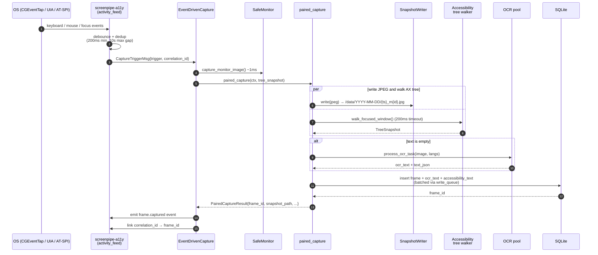

**Trigger table** (debounce per monitor):

| Trigger | Debounce | Notes |
|---------|----------|-------|
| `AppSwitch` | 300ms | Highest value; context change. |
| `WindowFocus` | 300ms | New tab / document. |
| `Click` | 200ms | Likely content change. |
| `TypingPause` | 500ms after last key | Result of typing, not every char. |
| `ScrollStop` | 400ms | New content visible. |
| `KeyPress` | 300ms | Only when `capture_keystrokes=true`. |
| `Clipboard` | 200ms | User grabbed context. |
| `VisualChange` | per-frame | Pixel diff outside the AX tree path. |
| `Idle` | 5-10s | Periodic safety net. |
| `Manual` | none | Forced. |

**Hard constraints**

- `200ms` minimum interval between captures per monitor.
- `10s` maximum gap (forces a capture even on static screens).
- AX tree walk is bounded by a `200ms` hard timeout (returns partial text on
  timeout for huge AX trees, e.g. Electron with 10k+ nodes).

**Pipeline characteristics** (typical):

| Stage | Latency |
|-------|---------|
| `capture_monitor_image` | ~1ms |
| `frame_comparer.compare` | ~1ms |
| `paired_capture` (AX path) | ~30-50ms |
| `paired_capture` (OCR fallback) | ~200-600ms |
| JPEG write | ~5-10ms |
| DB insert (batched) | ~5ms |

**Storage transform**

| Input | Output (frame row) |
|-------|-------------------|
| Screenshot + AX/OCR text + trigger + monitor | `frames(id, timestamp, device_name, app_name, window_name, browser_url, ocr_text, accessibility_text, text_source, capture_trigger, snapshot_path, offset_index=0, …)` |

### 5.2 Audio Capture Flow

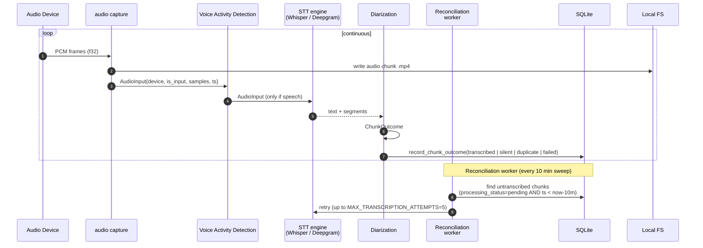

**Transform rules**

| Field | Source |
|-------|--------|
| `transcription_engine` | From `ChunkOutcome::Transcribed.engine` (e.g. `"whisper"`). |
| `transcription.timestamp` | Capture timestamp (not the processing time). |
| `processing_status` | `pending` → `transcribed` / `silent` / `duplicate` / `failed`. |
| `attempts` | Incremented on each `Failed`. Bounded by `MAX_TRANSCRIPTION_ATTEMPTS = 5`. |
| `diarization_segments` | Written only when text is non-empty (VAD + dedup). |

**Diarization key constraints**

- `idx_audio_transcription_chunk_text` UNIQUE index: identical trimmed text
  segments are silently dropped via `INSERT OR IGNORE`. Per-speaker timing is
  preserved in `diarization_segments`.

### 5.3 Search & Retrieval Flow

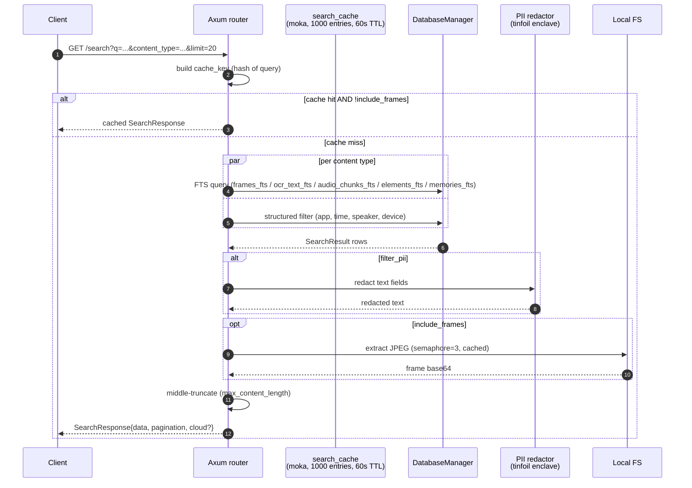

**Cache key** = hash of every field in `SearchQuery` (see `compute_search_cache_key`).
Adding/removing a query parameter changes the key, so stale results cannot leak
between filter configurations.

**Pipe permissions middleware**: if the request carries a `Bearer` token whose
`PipePermissions` is registered, the middleware enforces endpoint allow/deny
before the route runs and rewrites the response through PII redaction when
`privacy_filter: true`.

### 5.4 Pipe Execution Flow

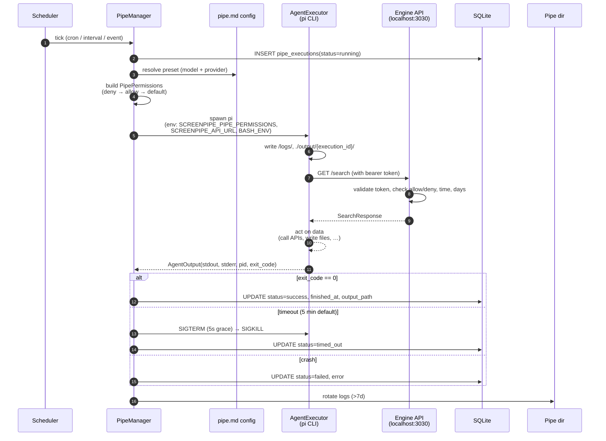

**Three-layer enforcement** (per the project's `README`):

1. **Skill gating** — the agent's skill descriptions omit endpoints it has no
   permission to use.
2. **Agent interception** — a BASH_ENV shim rewrites `curl .../search` calls to
   append `filter_pii=1` when `privacy_filter: true`.
3. **Server middleware** — `pipe_permissions_middleware` rejects unauthorized
   requests with HTTP 403, *before* the route handler runs.

**Spawn semantics**

- Pipes run as subprocesses with `cwd = ~/.screenpipe/pipes/{name}`.
- `ExecutionHandle.pid` is recorded at spawn for cancellation.
- Process groups / `setsid` are used so children of `pi` are killed on cancel.
- `SCREENPIPE_API_URL` defaults to `http://localhost:3030` (the engine URL).
- `SCREENPIPE_API_KEY` is forwarded when set; otherwise only the pipe's
  per-pipe bearer token is used.

### 5.5 Timeline Streaming Flow

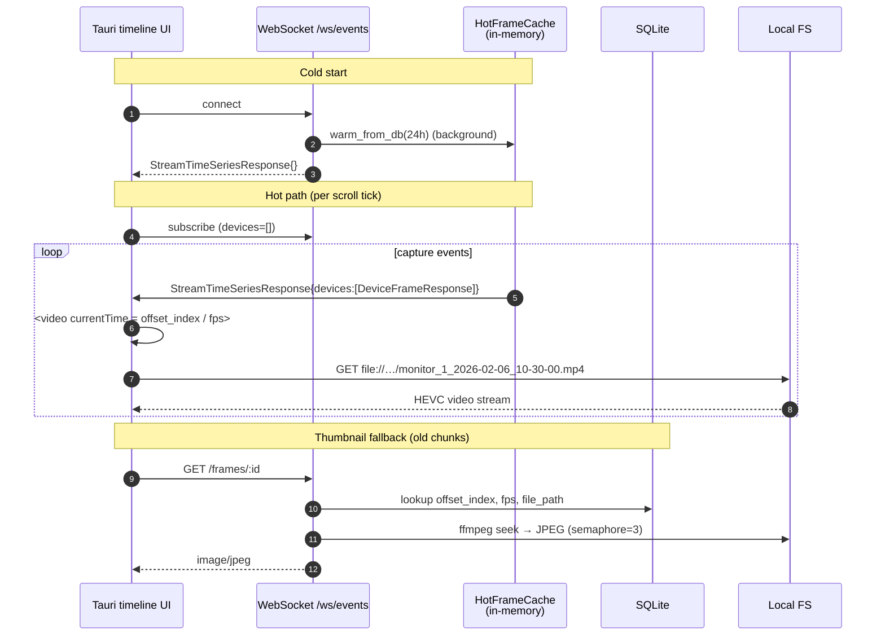

The legacy MP4 chunks use `-movflags frag_keyframe+empty_moov+default_base_moof`,
so even actively-recording files are seekable; the browser handles frame
display via hardware HEVC decode. See `docs/TIMELINE_VIDEO_SPEC.md` for full
detail.

### 5.6 End-to-End System Flow

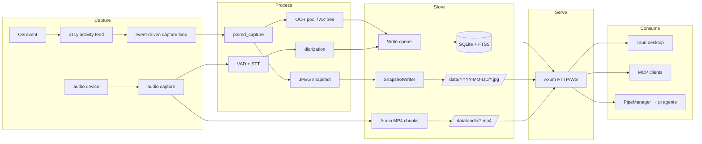

---

## 6. Storage Layout

```
~/.screenpipe/
├── data/
│   ├── YYYY-MM-DD/
│   │   ├── {ts}_m0.jpg     # monitor 0 snapshot
│   │   ├── {ts}_m1.jpg
│   │   └── …
│   ├── monitor_{id}_*.mp4  # legacy video chunks
│   └── audio/
│       └── input_*.mp4
│       └── output_*.mp4
├── db.sqlite               # main database
├── pipes/
│   └── {pipe_name}/
│       ├── pipe.md         # prompt + YAML frontmatter
│       ├── logs/           # rotated JSON logs
│       └── output/         # agent output
│           └── {execution_id}/
├── store.bin               # AI presets (user-configured)
├── auth.json               # provider API keys (mode 0600)
├── audio-exclusions.json   # macOS 14.4+ audio bundle excludes
└── vault/                  # encryption-at-rest keys (optional)
```

---

## 7. Configuration Surfaces

| Surface | Source | Format | Notes |
|---------|--------|--------|-------|
| Engine flags | CLI | `screenpipe record --port 3030 --disable-audio …` | See `crates/screenpipe-engine/src/cli/`. |
| `store.bin` | Desktop app | JSON | AI presets, per-user. Atomic rename on write. |
| `pipe.md` | User | YAML frontmatter + Markdown body | See 4.7.1. |
| `audio-exclusions.json` | User | JSON | `{ "excluded_apps": [{ "bundle_id", "name" }] }`; path overridable via `SCREENPIPE_AUDIO_EXCLUSIONS_PATH`. |
| `SCREENPIPE_*` env vars | Process | `KEY=VALUE` | `SCREENPIPE_API_KEY`, `SCREENPIPE_API_URL`, `SCREENPIPE_PIPE_PERMISSIONS`, `SCREENPIPE_FILTER_PII`, `SCREENPIPE_AUDIO_EXCLUSIONS_PATH`. |
| Database migrations | Code | SQL | `crates/screenpipe-db/src/migrations/`. |
| Permissions allow/deny | pipe.md | `Api()`, `App()`, `Window()`, `Content()` rules | See 4.7.3. |

---

## 8. Glossary

| Term | Definition |
|------|------------|
| **Pipe** | A scheduled AI agent defined by `pipe.md`; runs on captured data with deterministic permissions. |
| **Capture trigger** | The user/system event that caused a frame to be written (`app_switch`, `click`, `idle`, etc.). |
| **Paired capture** | Atomic operation: screenshot + accessibility walk + (optional) OCR + JPEG write, all under one timestamp. |
| **Frame** | A row in `frames` representing one captured moment on one monitor. |
| **Audio chunk** | A continuous slice of audio recorded from one device, persisted as `.mp4`. |
| **Reconciliation** | Periodic sweep that re-picks failed or untranscribed audio chunks. |
| **A11y / AX / UIA** | Accessibility APIs: Apple `AX`, Windows `UI Automation`, Linux `AT-SPI`. |
| **PII redaction** | On-device replacement of personally identifiable information in text before it leaves the device. |
| **Hot frame cache** | In-memory cache of recent frames used by the timeline WebSocket endpoint. |
| **FTS5** | SQLite's full-text search engine; used to index OCR text, transcriptions, memory, and accessibility nodes. |
| **Speaker** | A resolved identity (`speakers` row) with a centroid embedding for clustering. |
| **Pipe permission token** | Cryptographic bearer token issued to a pipe; maps to `PipePermissions` server-side. |
| **Pipe store** | Public registry of reusable pipes; installable via `/pipes/store/install`. |
| **Vault** | Optional AES-GCM encryption of the data directory at rest. |

---

## 9. Appendix: Cross-Reference

| Concept | Source file(s) |
|---------|----------------|
| Event-driven capture | `crates/screenpipe-engine/src/event_driven_capture.rs` |
| Paired capture | `crates/screenpipe-capture/src/paired_capture.rs` |
| Capture triggers | `crates/screenpipe-engine/src/event_driven_capture.rs` (`CaptureTrigger` enum) |
| Snapshot writer | `crates/screenpipe-screen/src/snapshot_writer.rs` |
| Database types | `crates/screenpipe-db/src/types.rs` |
| Search route | `crates/screenpipe-engine/src/routes/search.rs` |
| Content envelope | `crates/screenpipe-engine/src/routes/content.rs` |
| Pipe config | `crates/screenpipe-core/src/pipes/mod.rs` |
| Pipe permissions | `crates/screenpipe-core/src/pipes/permissions.rs` |
| Pipe API | `crates/screenpipe-engine/src/pipes_api.rs` |
| Health endpoint | `crates/screenpipe-engine/src/routes/health.rs` |
| WebSocket | `crates/screenpipe-engine/src/routes/websocket.rs` |
| Audio metrics | `crates/screenpipe-audio/src/metrics.rs` |
| Vision metrics | `crates/screenpipe-screen/src/metrics.rs` |
| HTTP server / router | `crates/screenpipe-engine/src/server.rs` |
| Migrations | `crates/screenpipe-db/src/migrations/` |
| Event bus | `crates/screenpipe-events/` |
| MCP server | `crates/screenpipe-connect/src/mcp_servers.rs` |
| Vision pipeline v2 spec | `docs/VISION_PIPELINE_SPEC.md` |
| Event-driven capture spec | `docs/EVENT_DRIVEN_CAPTURE_SPEC.md` |
| Batch audio transcription | `docs/BATCH_TRANSCRIPTION_SPEC.md` |
| Pipe execution reliability | `docs/PIPE_EXECUTION_SPEC.md` |
| Timeline video spec | `docs/TIMELINE_VIDEO_SPEC.md` |

---

**Versioning note**: types and routes documented here are pinned to the
`main` branch at the time of writing. For specific changelog details, see the
SQLite migration filenames in `crates/screenpipe-db/src/migrations/` — they
form the authoritative history of schema evolution.
